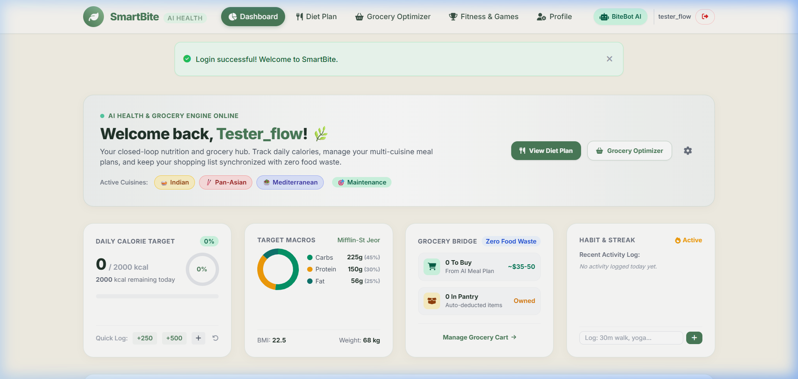
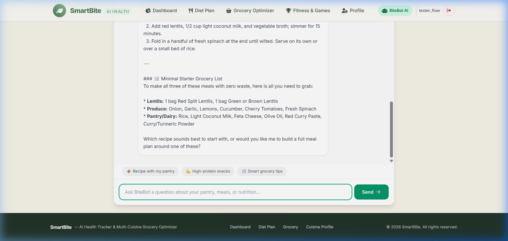

<div align="center">

# 🌿 SmartBite
### AI-Powered Health Tracker & Multi-Cuisine Zero-Waste Grocery Optimizer

[](https://www.python.org/)
[](https://flask.palletsprojects.com/)
[](https://aistudio.google.com/)
[](https://www.mongodb.com/)
[](https://docs.pytest.org/)
[](LICENSE)

<p align="center">
  <b>SmartBite unifies clinical biometric tracking, personalized multi-cuisine meal planning, automated zero-waste grocery consolidation, and live Google Gemini AI assistance into one seamless, production-grade application.</b>
</p>

[Explore Features](#-key-features) •
[Architecture](#-architecture--tech-stack) •
[Live UI Preview](#-ui-previews) •
[Quick Start](#-quick-start-guide) •
[API Docs](#-api-reference) •
[Security](#-security--data-integrity)

</div>

---

## 📸 UI Previews

<div align="center">
  <table>
    <tr>
      <td width="50%" align="center">
        <b>📊 Live Interactive Health Dashboard</b><br>
        
      </td>
      <td width="50%" align="center">
        <b>🤖 Real-Time BiteBot Gemini AI Assistant</b><br>
        
      </td>
    </tr>
  </table>
</div>

---

## 🚀 Key Features

### 🥗 1. Multi-Cuisine Dietary Personalization
- **World Cuisine Support**: Personalized nutrition across **Indian, Pan-Asian, Mediterranean, Mexican, and Continental** recipes.
- **Clinical Mifflin-St Jeor Engine**: Accurately computes Basal Metabolic Rate (BMR), Total Daily Energy Expenditure (TDEE), and daily caloric deficit/surplus.
- **Macro Optimization**: Standard balanced split (45% Carbs, 30% Protein, 25% Fat), with custom targets for Low-Carb/Keto and High-Protein diets.
- **Safety Floors & Allergen Guardrails**: Enforces clinical intake minimums (safety floor ≥ 1,200 kcal/day) and flags ingredients matching user-declared food allergens (gluten, dairy, peanuts, shellfish, etc.).

### 🛒 2. Zero-Waste Diet-to-Grocery Bridge
- **1-Click Push to Grocery**: Extracts and normalizes raw recipe ingredients from the user's weekly meal plan into an organized shopping checklist.
- **Automated Pantry Deductions**: Items already in your pantry are automatically subtracted from your grocery checklist to prevent food waste and duplicate spending.
- **Atomic Inventory Management**: Move items seamlessly between your shopping list and pantry inventory with atomic MongoDB updates (`$addToSet`, `$pull`).

### 🤖 3. Real Google Gemini AI Assistant (BiteBot)
- **Powered by Google Gemini 3.6 Flash**: Fast, conversational AI nutrition assistance via the modern `google-genai` SDK.
- **Contextual Grounding (RAG)**: Automatically grounds every response in the user's live daily calorie targets, declared allergens, and active pantry ingredients.
- **Intelligent Heuristic Fallback**: Includes a local synthesis engine that provides structured recipes and advice even if offline or if no API key is provided.

### 🏃 4. Gamified Fitness & Wellness Hub
- **Plank Timer Challenge**: Tracks core hold duration and awards achievement points saved directly to the database.
- **Repetition Counter Challenge**: Log workout repetitions (push-ups, squats, sit-ups) to update your activity audit.
- **Level & Rank Progression**: Unlock dynamic ranks (*Beginner* → *Novice* → *Intermediate* → *Advanced* → *Master*) as workout points accumulate.

---

## 🛠️ Architecture & Tech Stack

```
                          ┌───────────────────────────┐
                          │    Browser Client (UI)    │
                          │ HTML5, Tailwind, Chart.js │
                          └─────────────┬─────────────┘
                                        │ HTTP / JSON
                                        ▼
┌───────────────────────────────────────────────────────────────────────────┐
│                     SmartBite Unified Backend (app.py)                    │
│                                                                           │
│  ┌─────────────────────────────────────────────────────────────────────┐  │
│  │ 1. CONFIGURATION & APP INITIALIZATION                               │  │
│  │    Flask app, CORS, security cookies, environment configs           │  │
│  ├─────────────────────────────────────────────────────────────────────┤  │
│  │ 2. DATABASE & PERSISTENT STATE                                      │  │
│  │    MongoDB collections, unique email index, mongomock fallback      │  │
│  ├─────────────────────────────────────────────────────────────────────┤  │
│  │ 3. CORE DOMAIN SERVICES                                             │  │
│  │    • AuthService (Scrypt hashing, timed tokens, JWT, IDOR checks)   │  │
│  │    • NutritionService (Mifflin-St Jeor engine & allergen safety)    │  │
│  │    • GroceryService (Zero-waste deduction & atomic cart sync)       │  │
│  │    • AIService (Google Gemini 3.6 Flash RAG & smart fallback)       │  │
│  ├─────────────────────────────────────────────────────────────────────┤  │
│  │ 4. WEB UI ROUTES                                                    │  │
│  │    Jinja2 views: /dashboard, /diet_plan, /grocery, /bitebot, etc.   │  │
│  ├─────────────────────────────────────────────────────────────────────┤  │
│  │ 5. SECURE REST APIs                                                 │  │
│  │    IDOR-guarded endpoints: /api/dashboard/<id>, /api/ai/chat, etc.  │  │
│  └─────────────────────────────────────────────────────────────────────┘  │
└───────────────────────────────────────┼───────────────────────────────────┘
                                        │
                    ┌───────────────────┴───────────────────┐
                    ▼                                       ▼
       ┌─────────────────────────┐             ┌─────────────────────────┐
       │   MongoDB / mongomock   │             │ Google Gemini 3.6 Flash │
       │ Persistent Indexed Data │             │    Cloud Generative AI  │
       └─────────────────────────┘             └─────────────────────────┘
```

| Layer | Technologies & Tools |
| :--- | :--- |
| **Backend Framework** | Python 3.10+, Flask 3.x (Unified, readable single-file architecture in `app.py`) |
| **Code Organization** | 5 clearly commented sections: Config, Database, Services, UI Routes, REST APIs |
| **AI Integration** | Google Gemini 3.6 Flash via modern `google-genai` SDK with RAG grounding |
| **Database** | MongoDB with unique indexes & relational indexing (`mongomock` local fallback) |
| **Security** | Salted Scrypt hashing, cryptographic tokens (`itsdangerous`), IDOR protection |
| **Frontend** | Responsive HTML5, Tailwind CSS / Vanilla CSS, Chart.js, Font Awesome 6 |
| **Testing** | `pytest` (16 automated tests) + live multi-aspect integration test suite |

---

## 📂 Streamlined Codebase Structure

> **Designed for Maximum Readability**: Rather than scattering logic across dozens of confusing subdirectories and micro-files, SmartBite consolidates backend logic into a clean, linear, section-commented `app.py`. Any reviewer or recruiter can read the code top-to-bottom and understand the full system in minutes.

```
SmartBite/
├── app.py                       # Unified backend: Config, DB, Services, UI Routes, and REST APIs
├── requirements.txt             # Minimal, production-grade Python package dependencies
├── .env.example                 # Environment variable template with documented keys
├── .env                         # Active configuration (Secret keys, Gemini API key, DB URI)
│
├── scripts/
│   └── seed_db.py               # Standalone database seeder (Nutrition, recipes, grocery catalog)
│
├── tests/
│   ├── test_auth_security.py    # Security, password hashing, reset tokens, IDOR prevention tests
│   ├── test_data_integrity.py   # MongoDB persistence, zero-waste deductions, Mifflin-St Jeor tests
│   ├── test_ai_service.py       # BiteBot chat, pantry RAG grounding, allergen guardrail tests
│   ├── test_smartbite_models.py # User models and state management unit tests
│   └── comprehensive_test_suite.py # 6-aspect live server integration & concurrency suite
│
├── templates/                   # Clean Jinja2 HTML templates (Dashboard, Pantry, BiteBot, etc.)
├── static/                      # CSS styling, Chart.js widgets, and frontend scripts
├── dataset/                     # Reference nutrition and recipe datasets (CSV)
├── docs/screenshots/            # Visual walkthrough screenshots for GitHub
└── README.md                    # Comprehensive documentation and setup guide
```


---

## 📦 Quick Start Guide

### Prerequisites
- **Python 3.10+**
- **MongoDB** *(Optional: if local MongoDB is offline, SmartBite automatically falls back to in-memory `mongomock`)*

### 1. Clone the Repository
```bash
git clone https://github.com/Suruchidoke/SmartBite.git
cd SmartBite
```

### 2. Create and Activate Virtual Environment
```bash
# On Windows:
python -m venv venv
venv\Scripts\activate

# On macOS / Linux:
python3 -m venv venv
source venv/bin/activate
```

### 3. Install Dependencies
```bash
pip install -r requirements.txt
```

### 4. Configure Environment Variables
Copy `.env.example` to `.env`:
```bash
cp .env.example .env
```
Edit `.env` and add your **Google Gemini API Key** (get a free key from [Google AI Studio](https://aistudio.google.com/)):
```env
GEMINI_API_KEY=your_actual_gemini_api_key_here
GEMINI_MODEL=gemini-3.6-flash
```

### 5. Seed Datasets into MongoDB *(Optional)*
Populate MongoDB collections with recipes, nutritional data, and grocery catalogs:
```bash
python scripts/seed_db.py
```

### 6. Run the Application
```bash
python app.py
```
Open **[http://127.0.0.1:5000](http://127.0.0.1:5000)** in your browser.

---

## ⚙️ Environment Variables

| Variable | Default Value | Description |
| :--- | :--- | :--- |
| `SMARTBITE_PORT` | `5000` | HTTP port for the web server |
| `SMARTBITE_DEBUG` | `True` | Enable/disable Flask debug mode |
| `FLASK_ENV` | `development` | Environment mode (`development` / `production`) |
| `SMARTBITE_SECRET_KEY` | *(dev key)* | Session encryption secret (change in production) |
| `SMARTBITE_JWT_SECRET` | *(dev key)* | JWT signing secret |
| `MONGO_URI` | `mongodb://localhost:27017` | MongoDB connection string |
| `MONGO_DB` | `auto_diet_db` | MongoDB database name |
| `GEMINI_API_KEY` | `""` | Google Gemini AI API key |
| `GEMINI_MODEL` | `gemini-3.6-flash` | Gemini model variant (`gemini-3.6-flash`) |

---

## 📡 API Reference

<details>
<summary><b>Click to expand full REST API endpoints</b></summary>

### 🔐 Authentication & Profile
| Method | Endpoint | Description | Auth Required |
| :--- | :--- | :--- | :---: |
| `POST` | `/signup` | Register a new user account | No |
| `POST` | `/login` | Authenticate user and create session | No |
| `GET` | `/logout` | Terminate session | Yes |
| `POST` | `/forgot_password` | Generate cryptographic reset token | No |
| `POST` | `/reset_password/<token>` | Verify token and set new password | No |
| `POST` | `/profile` | Update biometrics (recalculates BMR/TDEE) | Yes |

### 📊 Dashboard & Health Tracking
| Method | Endpoint | Description | Auth Required |
| :--- | :--- | :--- | :---: |
| `GET` | `/api/dashboard/<user_id>` | Fetch user profile, live macros, and checklist | Yes (Ownership) |
| `POST` | `/api/health/<user_id>/log_calories` | Log meal calories consumed | Yes (Ownership) |
| `POST` | `/api/health/<user_id>/reset_calories`| Reset daily calories to 0 | Yes (Ownership) |
| `POST` | `/api/activity/<user_id>/add` | Record physical exercise and duration | Yes (Ownership) |

### 🥦 Diet Planning & Zero-Waste Grocery
| Method | Endpoint | Description | Auth Required |
| :--- | :--- | :--- | :---: |
| `POST` | `/api/diet_plan/push_to_grocery` | Consolidate diet ingredients & deduct pantry | Yes |
| `GET` | `/api/grocery/products` | Browse product catalog with pagination | No |
| `POST` | `/api/grocery/<user_id>/pantry/add` | Add ingredient to user pantry | Yes (Ownership) |
| `POST` | `/api/grocery/<user_id>/shopping/add` | Add item to shopping list | Yes (Ownership) |
| `POST` | `/api/grocery/<user_id>/move` | Atomically transfer item (shopping ⇄ pantry) | Yes (Ownership) |

### 🤖 BiteBot AI & Gamification
| Method | Endpoint | Description | Auth Required |
| :--- | :--- | :--- | :---: |
| `POST` | `/api/ai/chat` | Contextual conversation with Gemini 3.6 Flash | No |
| `POST` | `/api/ai/recipes/generate` | Generate recipes based on active pantry | No |
| `GET` | `/api/ai/health-insights/<user_id>` | Calorie adherence analysis & health tips | Yes (Ownership) |
| `POST` | `/api/quiz/save-score` | Persist fitness holds, reps, and quiz points | No |
| `GET` | `/api/achievements/<user_id>` | Retrieve rank, points, and level unlocks | No |

</details>

---

## 🧪 Testing & Quality Assurance

SmartBite is verified by a test suite covering unit logic, database persistence, security authorization, and AI integration:

```bash
# Run full unit & integration test suite
pytest tests/
```

```
============================= test session starts =============================
platform win32 -- Python 3.13.13, pytest-9.1.1, pluggy-1.6.0
rootdir: D:\project\SmartBite
collected 16 items

tests/test_ai_service.py ...                                             [ 18%]
tests/test_auth_security.py ....                                         [ 43%]
tests/test_data_integrity.py ....                                        [ 68%]
tests/test_smartbite_models.py .....                                     [100%]

============================= 16 passed in 4.30s ==============================
```

```bash
# Run live multi-aspect security & latency harness
python tests/comprehensive_test_suite.py
```

---

## 🔒 Security & Data Integrity

- **Broken Object-Level Authorization (IDOR) Blocked**: Endpoints enforce `@require_ownership("user_id")`. Unauthorized cross-user data access returns `403 Forbidden` (`IDOR_PREVENTED`).
- **Zero In-Memory Volatility**: The legacy in-memory user dictionary has been removed. All user state is atomically stored in MongoDB.
- **Cryptographic Reset Tokens**: Reset links use `itsdangerous.URLSafeTimedSerializer` with 1-hour expiration. Tampered or expired tokens are rejected.
- **Salted Password Hashing**: Passwords are encrypted using Werkzeug's Scrypt/PBKDF2 algorithms.
- **Secure Cookie Flags**: Session cookies are configured with `HttpOnly` and `SameSite=Lax`.

---

## 🚢 Production Deployment

To run SmartBite in a production environment:

```bash
# 1. Install production WSGI server
pip install gunicorn

# 2. Run with 4 worker processes
gunicorn -w 4 -b 0.0.0.0:5000 app:app
```

```dockerfile
# Dockerfile
FROM python:3.11-slim
WORKDIR /app
COPY requirements.txt .
RUN pip install --no-cache-dir -r requirements.txt gunicorn
COPY . .
EXPOSE 5000
CMD ["gunicorn", "-w", "4", "-b", "0.0.0.0:5000", "app:app"]
```

---

## 👤 Author

Developed by **[Suruchi Doke](https://github.com/Suruchidoke)**  
Contributions, issues, and feature requests are welcome! Feel free to check the [issues page](https://github.com/Suruchidoke/SmartBite/issues).

---

## 📄 License

This project is licensed under the **MIT License** — see the [LICENSE](LICENSE) file for details.

<div align="center">
  <sub>If you find SmartBite useful, please consider giving it a ⭐️ on GitHub!</sub>
</div>
